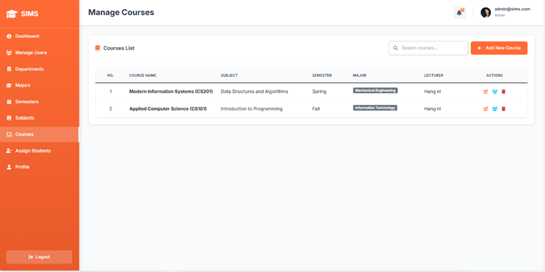
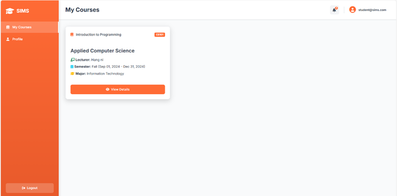
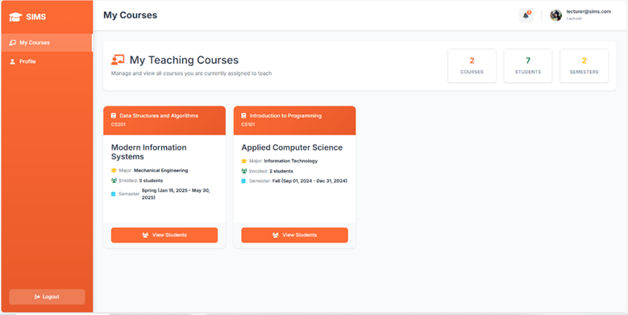

# SIMS - Student Information Management System

A modern student information management system built with ASP.NET Core 8.0, Entity Framework Core, and SQL Server.

## 🌟 Key Features

### 👨‍🎓 Students
- View list of enrolled courses
- Manage personal information

### 👨‍🏫 Lecturers
- View assigned course list
- Manage student lists in classes
- Track class statistics
- Update personal information

### 👨‍💼 Administrators
- Manage users (students, lecturers, admins)
- Manage departments and majors
- Manage semesters and subjects
- Manage courses and assign lecturers
- Assign students to courses

## 📸 Screenshots

### Admin Dashboard


*Main dashboard for administrators showing user management and system statistics.*

### Student Dashboard


*Student interface for course enrollment and personal information management.*

### Lecturer Dashboard


*Lecturer portal for managing assigned courses and student lists.*

## 🎨 Design and UX

- **Modern interface** with professional orange theme
- **Sidebar navigation** with role-based menu permissions
- **Responsive design** compatible with all devices
- **Intuitive dashboard statistics** for each role
- **Smooth animations and transitions**
- **Real-time form validation**

## 🏗️ System Architecture

```
SIMS/
├── Controllers/           # Controllers handling business logic
│   ├── AccountController  # Authentication and account management
│   ├── AdminController    # Administrative functions
│   ├── HomeController     # Dashboard and home page
│   ├── StudentController  # Student functionality
│   └── LecturerController # Lecturer functionality
├── Models/               # Data models and ViewModels
│   ├── Academic.cs       # Course, Subject, Semester
│   ├── User.cs           # User authentication
│   ├── UserRoles.cs      # Student, Lecturer, Admin
│   └── ViewModels/       # DTOs for Views
├── Views/                # Razor Views
│   ├── Account/          # Login, Register, Profile
│   ├── Admin/            # Admin management views
│   ├── Student/          # Student functionality views
│   ├── Lecturer/         # Lecturer functionality views
│   └── Shared/           # Layout and shared views
├── Services/             # Business logic services
│   ├── Implementations/  # Service implementations
│   └── Interfaces/       # Service interfaces
├── Data/                 # Database Context
├── Migrations/           # EF Core migrations
└── wwwroot/              # Static files (CSS, JS, Images)
```

## 🔧 Configuration and Installation

### System Requirements
- .NET 8.0 SDK
- SQL Server or SQL Server LocalDB
- Visual Studio 2022 or VS Code

### Installation Guide

1. **Clone repository**
   ```bash
   git clone [repository-url]
   cd SIMS
   ```

2. **Restore packages**
   ```bash
   cd SIMS
   dotnet restore
   ```

3. **Configure database**
   - Open file `SIMS/appsettings.json`
   - Update connection string:
   ```json
   {
     "ConnectionStrings": {
       "DefaultConnection": "Server=(localdb)\\mssqllocaldb;Database=SIMSDb;Trusted_Connection=true;MultipleActiveResultSets=true"
     }
   }
   ```

4. **Install Entity Framework Tools**
   ```bash
   dotnet tool install --global dotnet-ef
   ```

5. **Create database**
   ```bash
   dotnet ef migrations add InitialCreate
   dotnet ef database update
   ```

6. **Run application**
   ```bash
   dotnet run
   ```

7. **Open browser and access**: `https://localhost:5001` or `http://localhost:5000`

## 📊 Database Schema

### Main Tables
- **Users**: User information (AspNetUsers)
- **Students**: Student information
- **Lecturers**: Lecturer information
- **Admins**: Admin information
- **Departments**: Departments
- **Majors**: Majors
- **Subjects**: Subjects
- **Semesters**: Semesters
- **Courses**: Courses
- **StudentCourses**: Course enrollments

### Relationships
- User 1:1 Student/Lecturer/Admin
- Department 1:N Major
- Major 1:N Student
- Major 1:N Course
- Lecturer 1:N Course
- Student N:N Course (through StudentCourse)

## 🔐 Security

- **ASP.NET Identity**: Authentication and authorization
- **Role-based authorization**: Permission by roles
- **Password hashing**: Password encryption
- **CSRF protection**: Protection against CSRF attacks
- **Input validation**: Input data validation

## 🎯 Default Accounts

After running migrations, you can create the first admin account through the registration page.

### System Roles:
- **admin**: Full administrative privileges
- **lecturer**: Manage assigned classes
- **student**: Enroll and track courses

## 🚀 Advanced Features

- **Real-time validation**: Real-time form checking
- **Auto-save**: Automatic saving of changes
- **Search and filter**: Search within data tables
- **Export data**: Export data to CSV
- **Responsive sidebar**: Mobile-compatible left menu
- **Toast notifications**: Intuitive notifications
- **Loading states**: Professional loading effects

## 📱 Compatibility

- **Desktop**: Windows, macOS, Linux
- **Mobile**: iOS, Android (responsive)
- **Browsers**: Chrome, Firefox, Safari, Edge

## 🛠️ Technologies Used

- **Backend**: ASP.NET Core 8.0, Entity Framework Core
- **Database**: SQL Server
- **Frontend**: Razor Pages, Bootstrap 5, jQuery
- **Authentication**: ASP.NET Identity
- **Icons**: Font Awesome 6
- **Fonts**: Google Fonts (Inter)

## 📝 Development Notes

- Follows SOLID principles
- Clean code architecture
- Repository pattern can be added
- Unit testing can be expanded
- Logging and monitoring can be added

## 🤝 Contributing

1. Fork the repository
2. Create a feature branch
3. Commit changes
4. Push to branch
5. Create Pull Request

## 📄 License

MIT License - see LICENSE file for details.

## 📞 Support

If you encounter issues during installation or usage, please create an issue in the repository.

---

**SIMS** - Modern and professional student information management system! 🎓✨